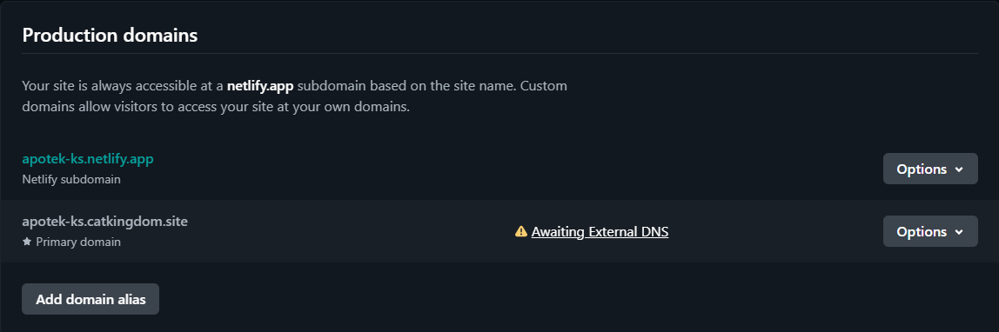

# Apotek Komunitas Sehat

This is a simple website for a pharmacy named Apotek Komunitas Sehat.

You may check the website <b>[here](https://apotek-ks.catkingdom.site/)</b>.

## About Project

This website consist of four sections. The first section displays some products that pharmacy has as well as the name and price. The second section contains a few health articles which embedded from instagram. The third section shows the locations of the pharmacies embedded from google maps and also the address of said pharmacies. The last section has "Contact Us" form for costomer consultation about medicines.

## Structure

- Navbar
- Header
- Main
    - Products
    - Health Contents
    - Locations
    - Contact Form
- Footer
    - Social Media
    - Copyright

## Languages

- HTML
- CSS

## Github Repository Set Up

1. Clone the repository from github
```
git clone https://github.com/RevoU-FSSE-4/milestone-1-mutiara-n.git
```

2. Create a new branch named "branch-1" to develop the website
```
git branch -b "branch-1"
```
3. After creating the new branch, use git checkout to navigate to the new branch
```
git checkout -b "branch-1"
```
4. Modify the website with personal information and push it once we're done
```
git add .
git commit -m "commit-message" // make sure to give details for the commit message
git push origin branch-1 
```
5. Once we're done, we can merge the branch into main branch.
```
git checkout main
git pull origin main
git merge develop // if there are any conflicts, we can resolve them manually
git commit -m "commit-message"
git push origin main
```

## Deployment Process

### Register and Deployment on Netlify

1. Register netlify account using github account.

    

    
    

2. Deploy the project using Netlify.
After we finished the register process, we could make a site based on the project we already have. Click "add new site" and choose "Import existing project".

    
    

3. Choose one of the github repositories that we wanted to deploy and fill the site name.
    
    
    
    

4. Wait for a few moments until the site finish the deployment and show the page below.

    

### Custom Domain Set Up

1. After we finish the site deployment, the next step is to set up a custom domain. First of all, we have to check the availability of our chosen custom domain name and choose the domain package we need.

    
    


2. Choose the package duration, then choose the payment method.

    
    

3. After we finished the payment, we would get the proof that the payment was a success!
    
    

4.  Register the domain by filling in your personal data.
After your domain registration is complete and you can begin to setup the custom domain.

    
    

5. Select the Domain Management menu on the Netlify site that has been deployed, then select Add Domain.

    

6. Add a custom subdomain according to the domain that has been registered.

    
    
        


7. As we can see from the previous image, the site cannot run without DNS. DNS setup can be done on niagahoster by replacing <b>nameservers</b> on the domain overview page with Netlify nameservers.

    
    
    
    

8. Wait for approximately 24 hours until the Awaiting External DNS sign changes to Netlify DNS, then the process of adding the custom domain is complete.

    